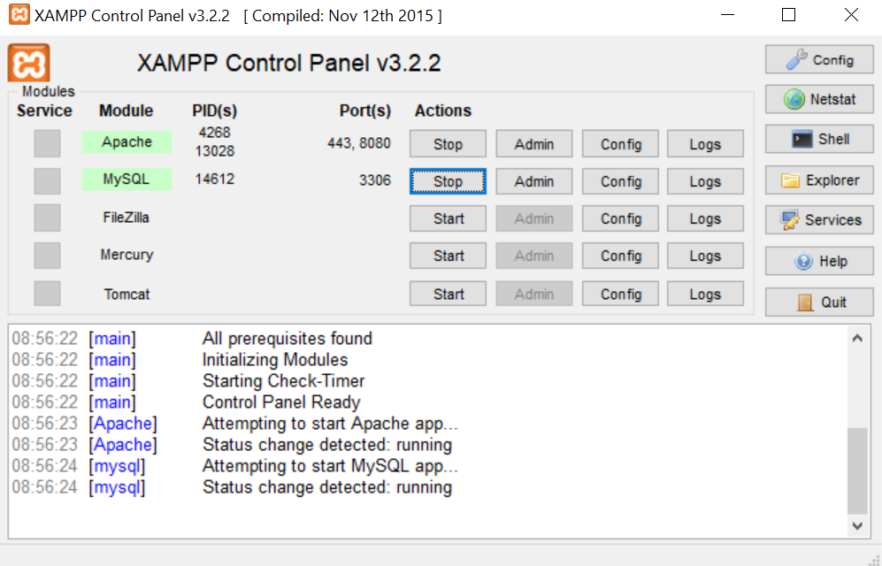

**Comment installer le jeu 🛠 :**

1. Installer les Prérequis.

Pour installer le langage Python ➔ [Python Install](https://www.python.org/downloads/)

Puis dans un de commande sur votre ordinateur (Powershell, etc..), tapez :
```bash
pip install pygame
```

2. Cloner le repo via un terminal de commande sur votre ordinateur (Powershell, etc..)

```bash 
git clone https://github.com/GauthierMichon/PykeJam.git
```

3. Installer la base de données (XAMPP ou équivalent).

Pour installer XAMPP ➔ [Xampp Install](https://www.apachefriends.org/fr/download.html)

Lancer Apache et Mysql dans le Xampp Panel :


Maintenant rendez vous sur http://localhost:8080/phpmyadmin/

Creez une base de données que vous appelerez **pykejam**

Maintenant, que la base de données est créé, il faut cliquer sur **importer**, sélectionner le fichier .sql qui se trouve dans le dossier BDD du repository.

Cliquez sur exécuter et votre base de données est créée.

4. Se rendre dans le dossier cloné simplement lancer le projet.

```bash 
cd PykeJam
python main.py 
```

---

**➔ Suite :** [Utilisation](https://github.com/GauthierMichon/PykeJam/blob/main/Documentation/Utilisation.md)

**➔ Informations :** [README](https://github.com/GauthierMichon/PykeJam)