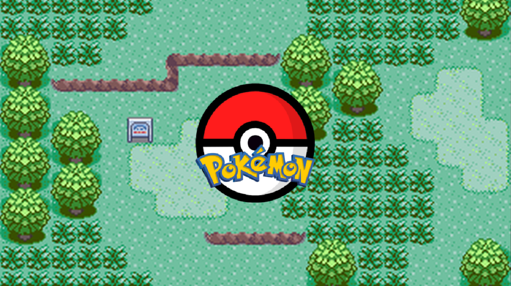
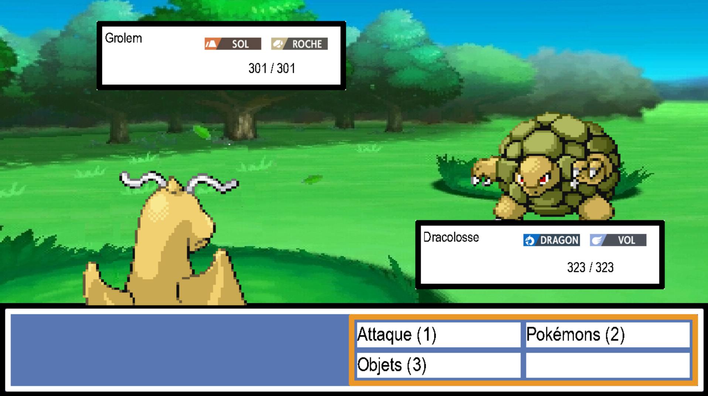
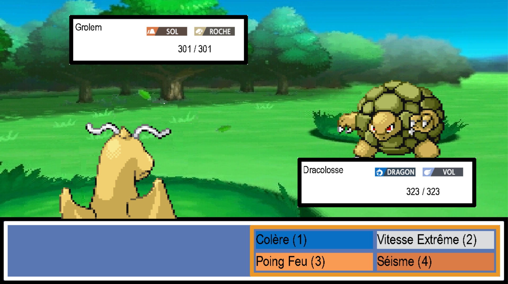
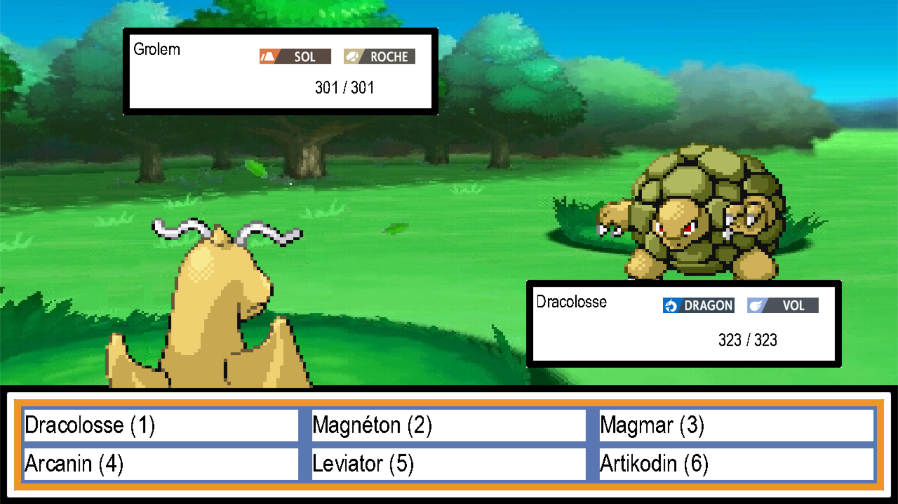
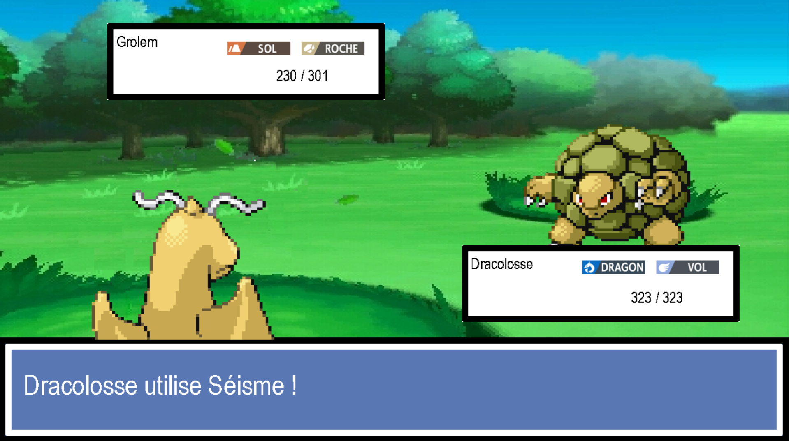

**Comment l'utiliser 🕹 :**

Lorsque vous lancerez le jeu, vous verrez un écran d'accueil.

Cliquez sur n'**importe quelle touche** pour commencer à jouer.

Vous arriverez ensuite dans une partie.

Sur cette page, nous avons les informations des pokemons (nom, types, PV), et les actions disponibles en cliquant sur les touches **1**, **2**, **3** de votre clavier.

Si vous avez cliqué sur **1** :

Vous arriverez sur cette page avec les différentes attaques disponibles et des couleurs pour représenter leurs type. (Si vous voulez revenir en arrière, cliquez sur la touche **b**.)

Si vous avez cliqué sur **2** :

Vous arriverez sur cette page avec les différents pokémons disponible. (Si vous voulez revenir en arrière, cliquez sur la touche **b**.)

Si vous avez cliqué sur **3** :

Vous arriverez sur cette page avec les différents objets utilisable. Si le fond d'une case est en rouge, alors le pokémon est dèjà K.O. et est inutilisable. Si le fond d'une case est en jaune, alors le pokémon a un problème de statut. (Si vous voulez revenir en arrière, cliquez sur la touche **b**.)

Après avoir choisi votre action, des informations sur le déroulement du combat s'afficheront sur la page.

Vous avez maintenant toutes les cartes en main pour jouer, enjoy !

---

**➔ Informations :** [README](https://github.com/GauthierMichon/PykeJam)