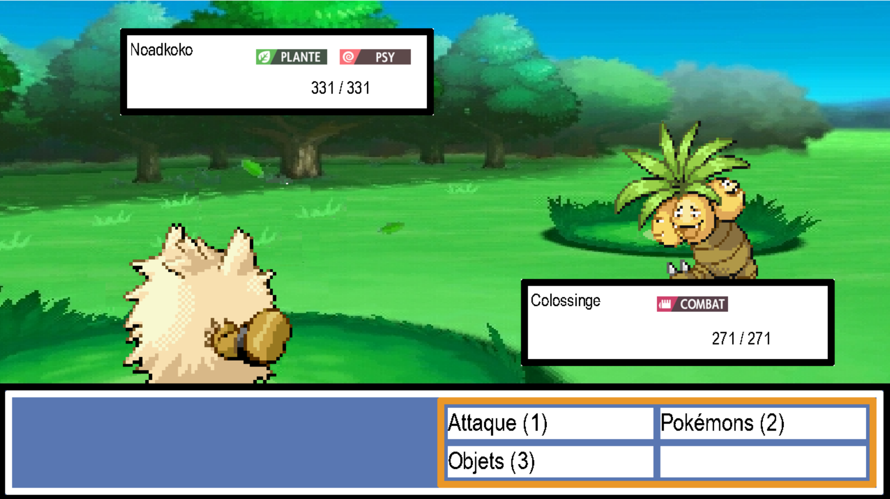
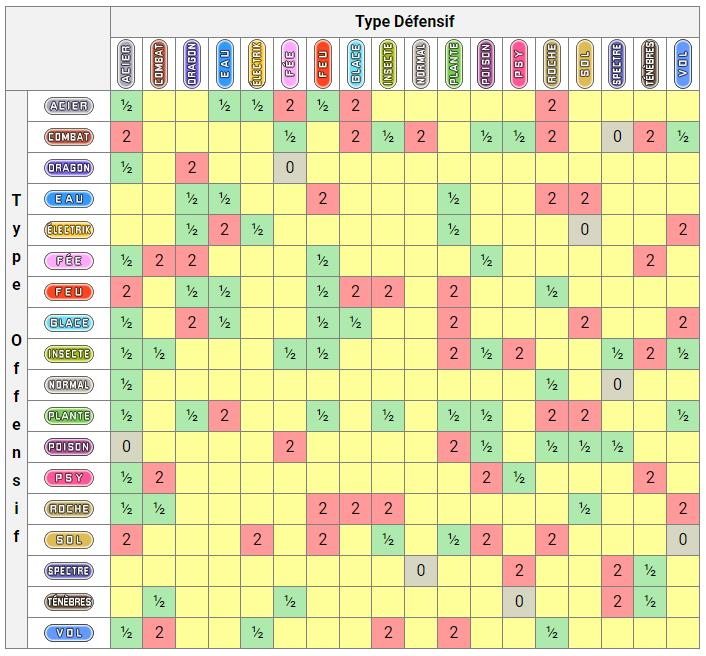

# Pykemon

---
🟢 = Terminé

🟠 = En cours

🔴 = Pas commencé

**To-do list :**

- Finir la base de données 🟢
- Donner des pokémons aléatoires aux dresseurs 🟢
- Possibilité de choisir son équipe de pokémons 🟠
- Possibilité de choisir un dresseur à affronter 🔴
- Possibilité de choisir parmis 3 actions 🟢 :
    - Faire une attaque 🟢
    - Changer de pokémon 🟢
    - Utiliser un objet 🟢
- Possibilité de revenir en arrière pendant le choix des actions 🟢
- Le code gère la possibilité de rater son attaque 🟢
- Le code gère les problèmes de statuts 🟢 :
    - Poison 🟢
    - Gel 🟢
    - Brûlure 🟢
    - Paralysie 🟢
    - Sommeil 🟢
- Le code gère les attaques offensives :
    - Si le pokémon est brûlé, divise sa puissance d'attaque physique par 2 🟢
    - Si le pokémon adverse a utilisé abri, ne lui inflige pas de dommages 🟢
    - Gère si l'attaque est physique ou spéciale
    - Gère le STAB (si l'attaque et le pokémon qui le lance sont de même type, dommages x1,5) 🟢
    - Gère la table des types 🟢
    
    - Possibilité de faire un coup critique 🟢
    - Gère le changement de puissance à cause du climat 🟢
    - Génère un nombre aléatoire pour faire une range de dégâts entre 85% et 100% 🟢
    - Si le pokemon adverse est caché derrière un clone, lui inflige les dommages à la place du pokémon 🟢
    - Gère l'effet de l'attaque s'il en possède un 🟢
- Le code gère les attaques de buff 🟢 :
    - Augmentation de statistique 🟢
    - Diminution de statistique 🟢
    - Maximum de 6 augmentation par stats 🟢
    - Maximum de 6 diminution par stats 🟢
- Le code gère les attaques de climat :
    - Le climat change 🟢
- Le code gère les attaques de heal 🟢 :
    - Le pokémon est soigné d'un certains pourcentage en fonction de l'attaque 🟢
    - Le pokémon ne peut pas se soigner plus que ses PV Maximum 🟢
- Le code gère les attaques de statut 🟢 :
    - Si le pokemon adverse est caché derrière un clone, le statut n'est pas appliqué 🟢
    - Si le pokemon adverse a déjà un statut, le statut n'est pas appliqué 🟢
    - Sinon le statut est appliqué 🟢
- Le code gère les attaques "autres" (qui rentres dans plusieurs catégories ou plusieurs) 🟢 :
    - En tout une cinquantaine d'attaques sont gérées individuellement 🟢
- Le code gère le changment de pokémons 🟢 :
    - Si le joueur a choisi de changer de pokémon 🟢
    - Si le pokémon actuel est K.O, le joueur change de pokémon 🟢
    - Impossibilité de changer de pokémon si le pokémon que l'on veut est K.O 🟢
- Le code gère les objets 🟢 :
    - Si le joueur a choisi d'utiliser un objet, il peut choisir un objet de son inventaire 🟢
    - Gère les objets de soin 🟢
    - Gère les objets de buff 🟢
    - Gère les objets de heal 🟢
- Gestion des PP des Attaques (nombre maximum d'utilisation) 🔴
- Graphique 🟢
- Animation d'attaque 🔴

---

# Documentation 👨🏼‍🏫

**Sommaire :**

[I. Installation](https://github.com/GauthierMichon/PykeJam/blob/main/Documentation/Installation.md)

[II. Utilisation](https://github.com/GauthierMichon/PykeJam/blob/main/Documentation/Utilisation.md)

